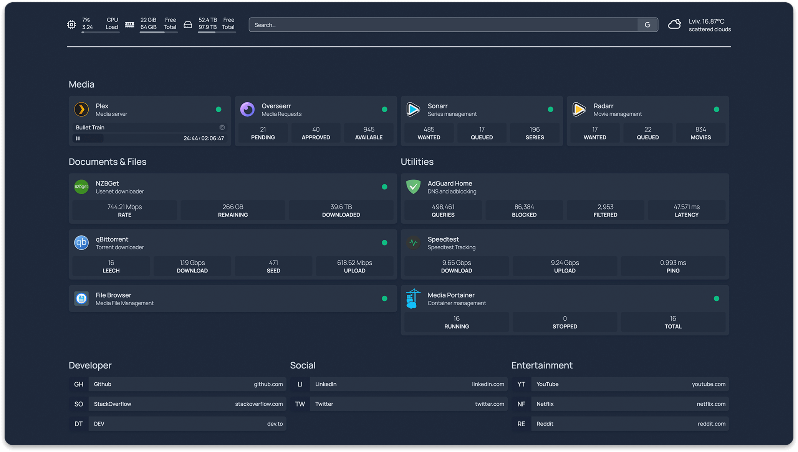
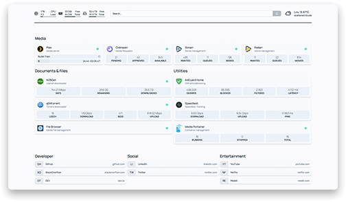
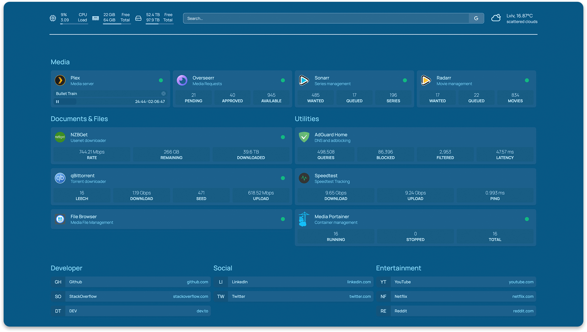
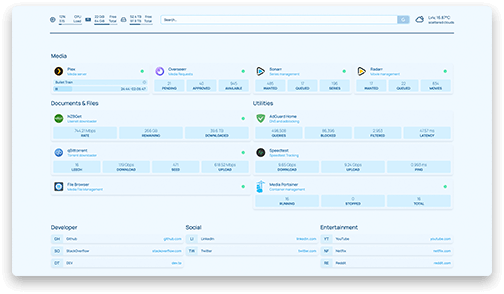
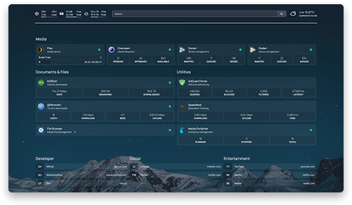
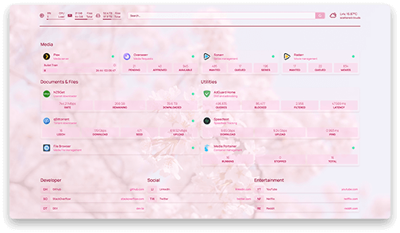

<p align="center">
  <picture>
    <source media="(prefers-color-scheme: dark)" srcset="images/banner_light@2x.png">
    
  </picture>
</p>

<p align="center">
  A modern <em>(fully static, fast)</em>, secure <em>(fully proxied)</em>, highly customizable application dashboard with integrations for more than 25 services and translations for over 15 languages. Easily configured via YAML files (or discovery via docker labels).
</p>

<p align="center">
  
</p>

<p align="center">
  
  
  
  
  
</p>

<p align="center">
  <a href="https://discord.gg/k4ruYNrudu"></a>
  <a href="https://paypal.me/phelpsben" title="Donate"></a>
</p>

<p align="center">
  <a href="https://github.com/benphelps/homepage/actions/workflows/docker-publish.yml"></a>
  <a href="https://hosted.weblate.org/engage/homepage/"></a>
</p>

## Features

- **Fast!** The entire site is statically generated at build time, so you can expect instant load times
- **Secure!** Every API request to backend services goes through a proxy server, so your API keys are never exposed to the frontend client.
- Images built for AMD64 (x86_64), ARM64, ARMv7 and ARMv6
  - Supports all Raspberry Pi's, most SBCs & Apple Silicon
- Full i18n support with automatic language detection
  - Translations for Catalan, Chinese, Dutch, Finnish, French, German, Hebrew, Hungarian, Norwegian Bokmål, Polish, Portuguese, Portuguese (Brazil), Romanian, Russian, Spanish, Swedish and Yue
  - Want to help translate? [Join the Weblate project](https://hosted.weblate.org/engage/homepage/)
- Service & Web Bookmarks
- Docker Integration
  - Container status (Running / Stopped) & statistics (CPU, Memory, Network)
  - Automatic service discovery (via labels)
- Service Integration
  - Sonarr, Radarr, Readarr, Prowlarr, Bazarr, Lidarr, Emby, Jellyfin, Tautulli (Plex)
  - Ombi, Overseerr, Jellyseerr, Jackett, NZBGet, SABnzbd, ruTorrent, Transmission, qBittorrent
  - Portainer, Traefik, Speedtest Tracker, PiHole, AdGuard Home, Nginx Proxy Manager, Gotify, Syncthing Relay Server, Authentic, Proxmox
- Information Providers
  - Coin Market Cap, Mastodon
- Information & Utility Widgets
  - System Stats (Disk, CPU, Memory)
  - Weather via WeatherAPI.com or OpenWeatherMap
  - Search Bar
- Customizable
  - 21 theme colors with light and dark mode support
  - Background image support
  - Column and Row layout options

## Support & Suggestions

If you have any questions, suggestions, or general issues, please start a discussion on the [Discussions](https://github.com/benphelps/homepage/discussions) page.

If you have a more specific issue, please open an issue on the [Issues](https://github.com/benphelps/homepage/issues) page.

## Getting Started

For configuration options, examples and more, [please check out the homepage site](http://gethomepage.dev).

### With Docker

Using docker compose:

```yaml
version: "3.3"
services:
  homepage:
    image: ghcr.io/benphelps/homepage:latest
    container_name: homepage
    ports:
      - 3000:3000
    volumes:
      - /path/to/config:/app/config # Make sure your local config directory exists
      - /var/run/docker.sock:/var/run/docker.sock # (optional) For docker integrations
```

or docker run:

```bash
docker run -p 3000:3000 -v /path/to/config:/app/config -v /var/run/docker.sock:/var/run/docker.sock ghcr.io/benphelps/homepage:latest
```

### With Node

First, clone the repository:

```bash
git clone https://github.com/benphelps/homepage.git
```

Then install dependencies and build the production bundle (I'm using pnpm here, you can use npm or yarn if you like):

```bash
pnpm install
pnpm build
```

If this is your first time starting, copy the `src/skeleton` directory to `config/` to populate initial example config files.

Finally, run the server:

```bash
pnpm start
```

## Configuration

Configuration files will be genereted and placed on the first request.

Configuration is done in the /config directory using .yaml files. Refer to each config for
the specific configuration options.

You may also check [the homepage site](http://gethomepage.dev) for detailed configuration instructions, examples and more.

## Development

Install NPM packages, this project uses [pnpm](https://pnpm.io/) (and so should you!):

```bash
pnpm install
```

Start the development server:

```bash
pnpm dev
```

Open [http://localhost:3000](http://localhost:3000) to start.

This is a [Next.js](https://nextjs.org/) application, see their doucmentation for more information:

## Contributors

<!-- ALL-CONTRIBUTORS-LIST:START - Do not remove or modify this section -->
<!-- prettier-ignore-start -->
<!-- markdownlint-disable -->

<!-- markdownlint-restore -->
<!-- prettier-ignore-end -->

<!-- ALL-CONTRIBUTORS-LIST:END -->


<!-- ALL-CONTRIBUTORS-BADGE:START - Do not remove or modify this section -->
[](#contributors)
<!-- ALL-CONTRIBUTORS-BADGE:END -->
