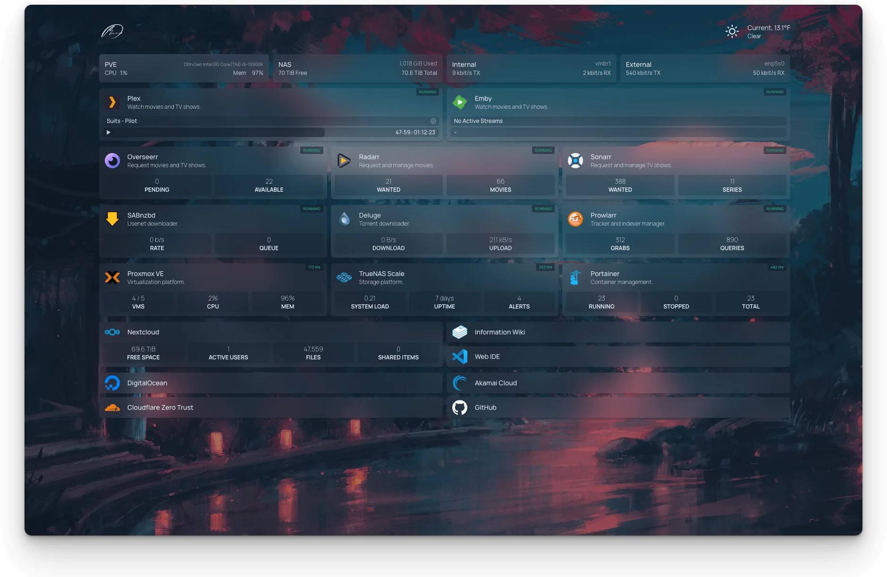

#

A modern, <em>fully static, fast</em>, secure <em>fully proxied</em>, highly customizable application dashboard with integrations for over 100 services and translations into multiple languages. Easily configured via YAML files or through docker label discovery.

