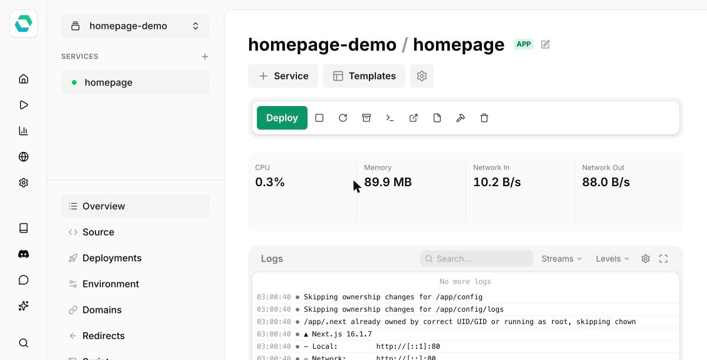

[Easypanel](https://easypanel.io) is a self-hosted Docker deployment platform, and homepage has a one-click deployment template there.

The template sets up a persistent volume for `/app/config` and mounts the Docker socket automatically so the [Docker integration](../configs/docker.md) works out of the box.

