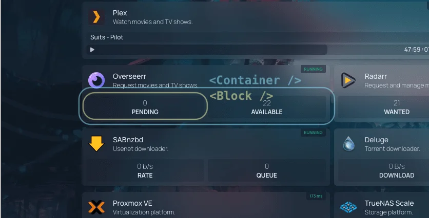

Homepage widgets are built using React components. These components are responsible for fetching data from the API and rendering the widget UI. Homepage provides a set of hooks and utilities to help you build your widget component.

## A Basic Widget Component

Here is an example of a basic widget component:

```js
import { useTranslation } from "next-i18next";

import Container from "components/services/widget/container";
import Block from "components/services/widget/block";
import useWidgetAPI from "utils/proxy/use-widget-api";

export default function Component({ service }) {
  const { t } = useTranslation();
  const { widget } = service;
  const { data, error } = useWidgetAPI(widget, "info");

  if (error) {
    return <Container service={service} error={error} />;
  }

  if (!data) {
    return (
      <Container service={service}>
        <Block label="yourwidget.key1" />
        <Block label="yourwidget.key2" />
        <Block label="yourwidget.key3" />
      </Container>
    );
  }

  return (
    <Container service={service}>
      <Block label="yourwidget.key1" value={t("common.number", { value: data.key1 })} />
      <Block label="yourwidget.key2" value={t("common.number", { value: data.key2 })} />
      <Block label="yourwidget.key3" value={t("common.number", { value: data.key3 })} />
    </Container>
  );
}
```

### Breakdown

We'll cover two sections of the widget component: hooks and components.

#### Hooks

**`useTranslation`**

This hook is used to translate text and numerical content in widgets. Homepage provides a set of helpers to help you localize your widgets. You can learn more about translations in the [Translations Guide](translations.md).

**`useWidgetAPI`**

This hook is used to fetch data from the API. We cover this hook in more detail in the [API Guide](api.md).

#### Components

Homepage provides a set of components to help you build your widget UI. These components are designed to provide a consistent layout, and all widgets are expected to use these components.



**`<Container>`**

This component is a wrapper for the widget. It provides a consistent layout for all widgets.

```js
<Container service={service}></Container>
```

`service` is a prop that is passed to the widget component. It contains information about the service that the widget is displaying.

If there is an error fetching data from the API, the `error` prop can be passed to the `Container` component.

```js
<Container service={service} error={error}></Container>
```

**`<Block>`**

This component is used to display a key-value pair. It takes a label and value as props.

```js
<Block label="yourwidget.key1" value={t("common.number", { value: data.key1 })} />
```

The `label` prop is used to look up the translation key in the translation files. The `value` prop is used to display the value of the block. To learn more about translations, please refer to the [Translations Guide](translations.md).

If there is no data available, the `Block` component can be used to display a placeholder layout.

```js
<Container service={service}>
  <Block label="yourwidget.key1" />
  <Block label="yourwidget.key2" />
  <Block label="yourwidget.key3" />
</Container>
```
