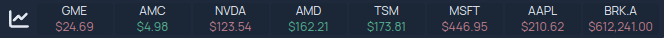
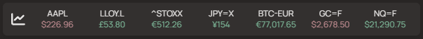

_(Find the Stocks service widget [here](../services/stocks.md))_

The Stocks Information Widget allows you to include basic stock market data in
your Homepage header. The widget includes the current price of a stock, and the
change in price for the day.


#### Finnhub.io

Finnhub.io free API only supports US stocks.
You can sign up for a free api key at [finnhub.io](https://finnhub.io).
You are encouraged to read finnhub.io's
[terms of service/privacy policy](https://finnhub.io/terms-of-service) before
signing up. The documentation for the endpoint that is utilized can be viewed
[here](https://finnhub.io/docs/api/quote).

You must set `finnhub` as a provider in your `settings.yaml` like below:

```yaml
providers:
  finnhub: yourfinnhubapikeyhere
```

Next, configure the stocks widget in your `widgets.yaml`:

The information widget allows for up to 8 items in the watchlist.

```yaml
- stocks:
    provider: finnhub
    color: true # optional, defaults to true
    cache: 1 # optional, default caches results for 1 minute
    watchlist:
      - GME
      - AMC
      - NVDA
      - AMD
      - TSM
      - MSFT
      - AAPL
      - BRK.A
```

The above configuration would result in something like this:



#### Yahoo Finance
Yahoo Finance is a free provider and doesn't require any API key or authentication.
The API is not officially supported by Yahoo, so it may be subject to change or may be unreliable (e.g. rate limited).
Some data may be delayed for up to 15 minutes depending on the stock exchange.

You may use the quote lookup tool on the [Yahoo Finance website](https://finance.yahoo.com/) to find the symbol you are interested in.

Generally the following rules apply:
 - US stocks: `TICKER`
 - International stocks: `TICKER.STOCKEXCHANGE`
 - Indices: `^INDEX`
 - Forex: `TICKER=X`
 - Cryptocurrencies: `TICKER-CURRENCY`
 - Commodities/futures: `TICKER=F`
 - Options: `TICKERDATESTRIKE` **(not recommended due to the excessive length)**

```yaml
- stocks:
    provider: yahoofinance
    color: true # optional, defaults to true
    cache: 1 # optional, default caches results for 1 minute
    watchlist:
      - AAPL
      - LLOY.L
      - ^STOXX
      - JPY=X
      - BTC-EUR
      - GC=F
      - NQ=F
```
The above configuration would result in something like this:

