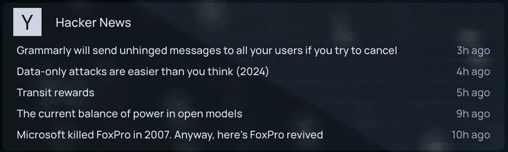
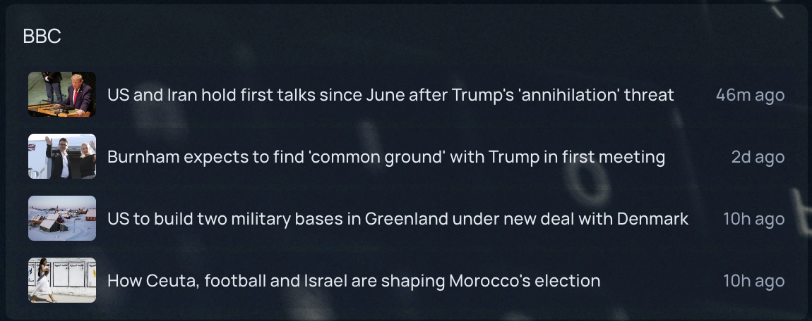
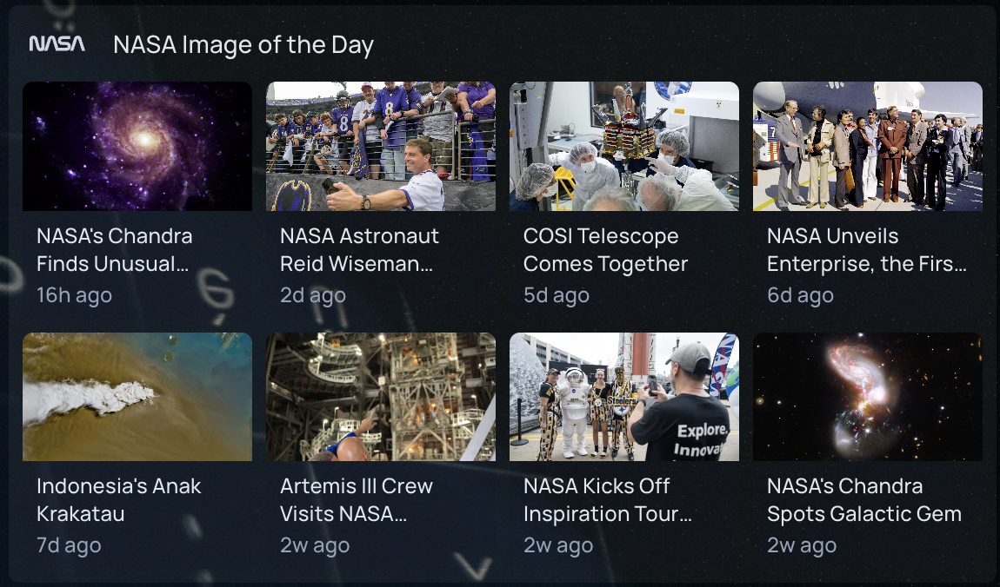

This widget shows the latest items from an RSS 2.0 or Atom feed.

```yaml
widget:
  type: feed
  url: https://feeds.bbci.co.uk/news/rss.xml
  maxItems: 5 # optional - defaults to 5
  layout: list # optional - possible values list, grid - defaults to list
  images: true # optional - set to false to hide images - defaults to true
```

## Layouts

`list` shows one row per item. Items with an image get a small thumbnail.





`grid` shows image tiles that re-flow to fit the width of the widget, e.g.:

```yaml
- World News:
    widget:
      type: feed
      url: https://feeds.bbci.co.uk/news/world/rss.xml
      layout: grid
      maxItems: 8
```



## Images

Images are taken from the feed's `media:thumbnail` / `media:content` tags or image enclosures, falling back to the first image in the item's content. Some feeds do not include images at all.

Images are loaded by your browser directly from the feed's host, at whatever size the feed provides. Feeds that link full-size originals can be slow to load; set `images: false` for those.

## Notes

Feeds are fetched by homepage, not your browser, and cached for 10 minutes.
