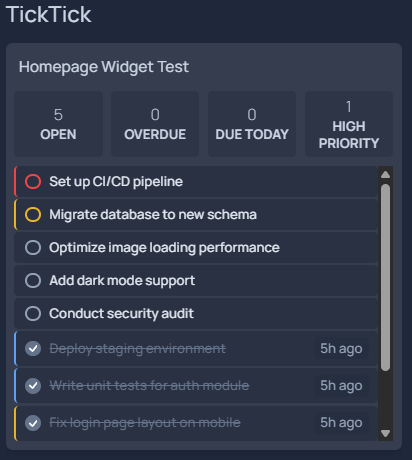
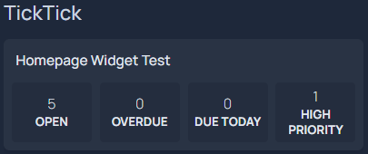

Learn more about [TickTick](https://ticktick.com).

Requires an OAuth2 access token. Register an app at [developer.ticktick.com](https://developer.ticktick.com/) and follow the [official token guide](https://developer.ticktick.com/api#/openapi?id=get-access-token), or use the steps below:

1. Open in your browser (replace `CLIENT_ID`):
   ```
   https://ticktick.com/oauth/authorize?scope=tasks:read&client_id=CLIENT_ID&redirect_uri=http://localhost&response_type=code
   ```
2. After authorizing, copy the `code` from the redirect URL
3. Exchange it for a token (replace `CLIENT_ID`, `CLIENT_SECRET`, `CODE`):
   ```bash
   curl -X POST https://ticktick.com/oauth/token \
     -u "CLIENT_ID:CLIENT_SECRET" \
     -d "code=CODE&grant_type=authorization_code&redirect_uri=http://localhost"
   ```
   The `access_token` in the response is your API key

To find your project ID, open the [TickTick web app](https://ticktick.com/webapp/), click a list, and copy the hex ID from the URL: `#p/<projectId>/tasks`

Allowed fields: `["totalTasks", "openTasks", "completedTasks", "overdueTasks", "dueTodayTasks", "highPriorityTasks"]`

`overdueTasks`, `dueTodayTasks`, and `highPriorityTasks` count only open tasks. `highPriorityTasks` counts only tasks with High priority (not Medium).

```yaml
widget:
  type: ticktick
  url: https://api.ticktick.com
  key: { { HOMEPAGE_VAR_TICKTICK_TOKEN } }
  projectId: your_project_id
  fields: [openTasks, overdueTasks, dueTodayTasks, highPriorityTasks] # optional
  taskListEnabled: true # optional, defaults to false
  taskFilter: open # optional — open, closed, or all
  taskFetchLimit: 50 # optional, limits how many tasks are shown
  taskListHeight: 200px # optional, adds scrolling when the list exceeds this height
  taskLink: app # optional — web or app
  completedLookbackDays: 90 # optional, days to look back for completed tasks (default 90)
```



If the task list is taller than `taskListHeight`, it becomes scrollable. Set `taskListHeight` to a CSS value like `200px` or `12rem` — without it the list grows to fit all tasks:

```yaml
taskListEnabled: true
taskListHeight: 200px # list scrolls when tasks don't fit
```

`taskLink: app` opens the desktop app and searches by task title (deep-linking to a specific task is not supported)

Stats-only example (no task list):

```yaml
widget:
  type: ticktick
  url: https://api.ticktick.com
  key: { { HOMEPAGE_VAR_TICKTICK_TOKEN } }
  projectId: your_project_id
  fields: [openTasks, dueTodayTasks, highPriorityTasks]
```


